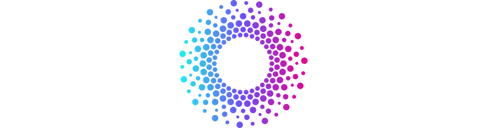

  

    Visual formal verification EVM smart contracts.

 

    
    
    

  <a href="https://docs.state.space/docs/overview/intro"><strong>Introduction</strong></a> |
  <a href="https://docs.state.space/docs/overview/quickstart"><strong>Quickstart</strong></a> |
  <a href="https://docs.state.space/docs/overview/features"><strong>Features</strong></a> |
  <a href="https://docs.state.space"><strong>Documentation</strong></a> |
  <a href="https://docs.state.space/docs/tutorials/erc20-pause-mint"><strong>Tutorials</strong></a> |
  <a href="https://state.space/sign-up"><strong>Create Account</strong></a>

